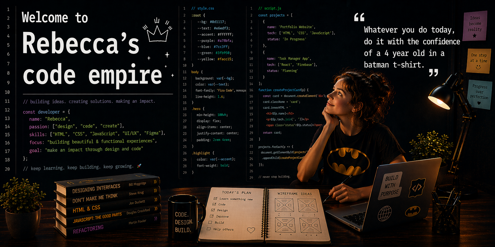

<h1 align="center"><link scr="https://capsule-render.vercel.app/api?type=venom&height=300&color=gradient&text=Hello,%20welcome%20to%20my%20code%20space!&section=header&reversal=false&textBg=false&fontColor=black&fontSize=48&fontAlign=50&fontAlignY=50&rotate=0&descAlign=40&descAlignY=60"/></h1>

I’m a Web Development student in my second year based in Malmö, Sweden.👩🏻‍🎓📚  Currently focusing on front-end development and UX/UI design, with experience in building user-friendly web applications, while also expanding my backend knowledge in Java and Python.

  
  
  
  
  
  
   

  
  
  
   
  
  
  
  
  
  

## 👩🏻‍💻 My Projects

| Project | Description | Tech Stack | Link |
|---------|-------------|------------|------|
| **Simple Calculator** | A simple calculator built with JavaScript, featuring dynamic DOM manipulation, event handling, and basic arithmetic operations. | HTML • CSS • Javascript | [GitHub](https://github.com/Becconor/Simple-Calculator.git)

## 📈 GitHub Stats

  
  

